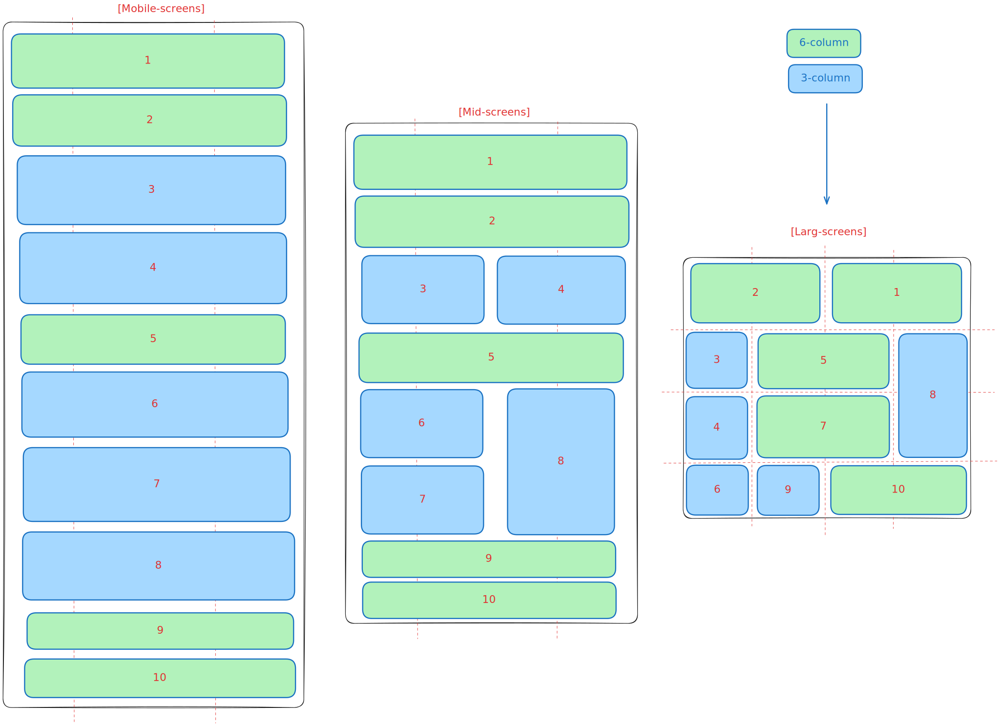

# Responsive Grid Layout

This project demonstrates a responsive grid layout that adapts across mobile, tablet, and desktop screen sizes. The layout is showcased in the SVG diagram below.

### Layout Diagram
  

---

The SVG diagram shows how the grid layout transitions between mobile, tablet, and desktop views using CSS media queries and a mobile-first approach.
